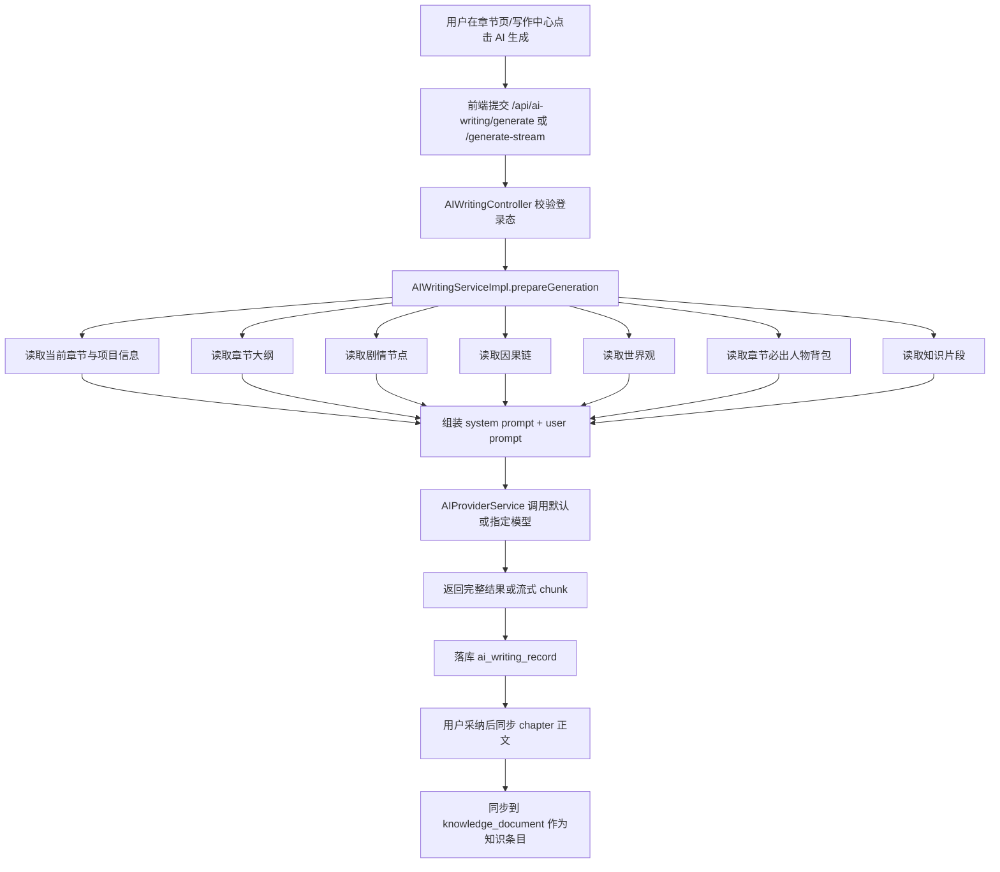
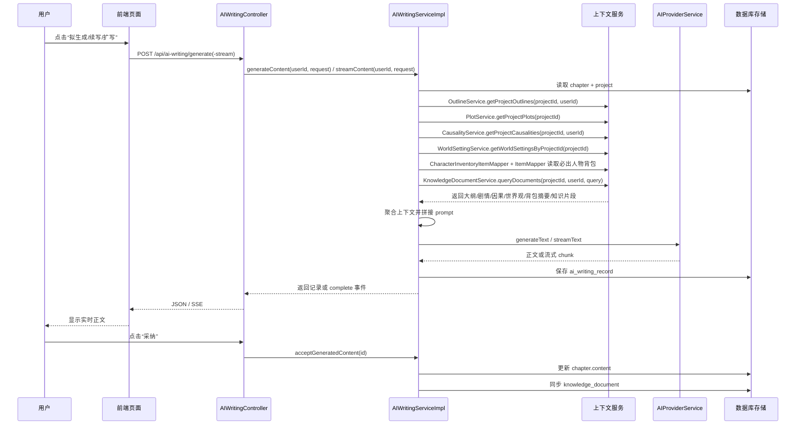

# AI 写作上下文流转说明

这份文档描述的是当前代码里的真实链路，核心入口在：

- `front/src/views/writing/WritingView.vue`
- `front/src/views/chapter/ChapterListView.vue`
- `backend/src/main/java/com/storyweaver/controller/AIWritingController.java`
- `backend/src/main/java/com/storyweaver/service/impl/AIWritingServiceImpl.java`

## 1. 总体流程图

## 2. 泳道图

## 3. 上下文读取规则

### 3.1 当前章节

始终读取：

- 章节标题
- 章节顺序
- 当前正文
- 本章必须出现人物
- 本章必须出现人物的背包摘要（如存在）

代码位置：

- `AIWritingServiceImpl.prepareGeneration(...)`
- `AIWritingServiceImpl.buildUserPrompt(...)`
- `AIWritingServiceImpl.buildRequiredCharacterInventories(...)`

### 3.2 大纲

优先读取当前章节绑定的大纲：

- `chapter_outline.chapter_id == 当前 chapter.id`

读取内容包括：

- 大纲标题
- 摘要
- 本章目标
- 核心冲突
- 关键转折
- 收束方向
- 聚焦人物
- 大纲里手工关联的剧情 ID / 因果 ID

代码位置：

- `OutlineController`
- `OutlineServiceImpl`
- `AIWritingServiceImpl.buildContextBundle(...)`

### 3.3 剧情节点

剧情上下文有两层来源：

1. 优先取“与当前章节直接绑定”或“被当前大纲显式关联”的剧情节点  
2. 如果没有匹配项，则回退到项目下前几条剧情节点

进入 prompt 的主要字段：

- 标题
- 描述
- 冲突
- 预期解法

代码位置：

- `PlotController`
- `PlotService`
- `AIWritingServiceImpl.appendPlotSection(...)`

### 3.4 因果链

因果上下文同样是两层来源：

1. 优先取“大纲里显式关联”的因果链  
2. 如果没有匹配项，则回退到项目下前几条因果记录

进入 prompt 的主要字段：

- 名称 / 关系描述
- 描述
- 触发条件

代码位置：

- `CausalityController`
- `CausalityServiceImpl`
- `AIWritingServiceImpl.appendCausalitySection(...)`

### 3.5 世界观

世界观从项目已关联的世界观模型中读取，取前几条进入 prompt：

- 名称
- 分类
- 描述

代码位置：

- `WorldSettingController`
- `WorldSettingServiceImpl`
- `AIWritingServiceImpl.appendWorldSettingSection(...)`

### 3.6 章节人物背包

只读取当前章节“必出人物”的背包，不读取项目下所有人物背包：

- 物品名称 / 自定义名称
- 数量
- 装备状态
- 耐久（低于 100 时）
- 备注或物品简述

进入 prompt 的目的是让模型知道当前章节角色手上实际持有什么，不再只依赖人物设定文本自行假设。

代码位置：

- `CharacterInventoryItemMapper`
- `ItemMapper`
- `AIWritingServiceImpl.appendCharacterInventorySection(...)`

### 3.7 知识片段

知识片段是一个轻量检索分支，当前查询词由这几部分拼接：

- 章节标题
- 用户补充要求
- 当前大纲摘要或标题

检索命中后，会把标题和摘要拼进 prompt，作为补充记忆。

代码位置：

- `KnowledgeDocumentServiceImpl.queryDocuments(...)`
- `AIWritingServiceImpl.buildContextBundle(...)`

## 4. Prompt 组装顺序

当前 `user prompt` 的顺序是：

1. 项目信息
2. 当前章节
3. 章节人物背包
4. 章节大纲
5. 相关剧情节点
6. 相关因果链
7. 世界观上下文
8. 知识片段
9. 当前正文
10. 用户补充要求

这样做的目的，是先给模型一个稳定的“结构骨架”，再给“剧情推进约束”，最后才给当前正文和临时指令。

## 5. 这次新增了什么

相对之前只读“项目 + 章节 + 当前正文”的版本，这次补了：

- 独立的大纲模块 `chapter_outline`
- 大纲与章节、人物、剧情、因果的结构化关联
- AI 生成前自动读取当前章节大纲
- 剧情、因果、世界观、知识片段一起参与上下文聚合

## 6. 当前边界

目前的上下文聚合仍然偏“规则筛选”，不是 embedding 级的深度召回：

- 剧情和因果主要靠章节绑定或大纲手动关联
- 背包上下文目前只覆盖章节必出人物，不自动扩散到全部关联角色
- 知识片段仍是关键词检索，不是向量检索
- 如果一个章节没有绑定大纲，会自动回退到“项目级剧情/因果/世界观”

这意味着现在已经足够支撑章节写作，但如果后续想继续提升命中质量，下一步最值得做的是：

- 大纲的 AI 生成 / 扩写
- 更精细的上下文召回评分
- 真正的向量化 RAG 检索
